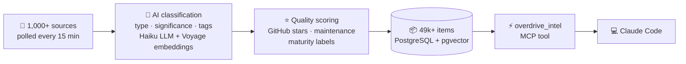

# Overdrive Intel

**Everything new in AI coding — delivered straight to your agent.**

New MCP servers, Claude Code skills, agent frameworks, SDK updates — the ecosystem moves faster than anyone can track. Most developers piece it together from Twitter, Reddit, newsletters, and Discord. By the time you hear about a tool, you've already built the thing it replaces.

Overdrive Intel plugs directly into Claude Code as an MCP server. It continuously monitors 1,000+ sources and indexes what's new. Your agent automatically knows about tools, features, and changes that aren't in its training data — and surfaces them exactly when they're relevant.

```
You: "What's the best MCP server for working with Postgres?"

Agent calls overdrive_intel → instant, quality-ranked results:

  1. timescale/pg-aiguide      ★ 1,640 · established  — EXPLAIN analysis, index tuning
  2. supabase-community/mcp    ★ 814   · emerging     — full Supabase DB + auth access
  3. postgres_mcp              ★ 6     · new           — lightweight, readonly modes
```

```
You: "Are there any new Claude Code features I should know about?"

Agent calls overdrive_intel → latest updates:

  → Claude Code Hooks: pre-commit, post-tool, notification hooks (2 days ago)
  → Agent SDK v0.2.0: multi-agent orchestration, handoff patterns (4 days ago)
  → New /co:plan-phase skill for implementation planning (1 week ago)
```

No newsletters. No scrolling Twitter. Your agent already knows.

## Install

Paste this into your Claude Code conversation:

```bash
bash <(curl -s https://inteloverdrive.com/dl/setup.sh)
```

That's it. Claude runs the command, registers anonymously, installs the MCP server, and configures itself. No email, no account, no configuration.

```bash
# or via npm
npm i -g intel-overdrive-mcp
```

Built for **Claude Code**. Also available as a [REST API](https://inteloverdrive.com/v1/guide).



## What you can ask

| Question                                          | What your agent finds                             |
| ------------------------------------------------- | ------------------------------------------------- |
| "What MCP servers exist for databases?"           | Quality-ranked list with stars, maturity labels   |
| "Any new agent frameworks worth trying?"          | Latest frameworks, compared by community traction |
| "Did anything break in the OpenAI SDK?"           | Specific version, what broke, how to migrate      |
| "What's the best practice for Claude Code hooks?" | Synthesized patterns from community sources       |
| "Are there security issues with Context7?"        | CVE details, patch status, disclosure timeline    |
| "What's new this week?"                           | Curated feed of the most significant updates      |

Your agent also calls it **automatically** — when you ask it to write code using a library, it checks for breaking changes before writing outdated patterns.

## Why not just let the agent search the web?

|                 | Agent web search                                              | Overdrive Intel                                 |
| --------------- | ------------------------------------------------------------- | ----------------------------------------------- |
| **Speed**       | 10-30s of Googling, scraping, parsing                         | One call, instant                               |
| **Cost**        | Multiple tool calls, burns tokens reading pages               | Single call, pre-compressed                     |
| **Reliability** | Scrapes may fail, results outdated or wrong                   | Pre-indexed, verified, quality-scored           |
| **Quality**     | No ranking — can't tell a 30k-star SDK from a weekend project | Star counts, quality labels, significance tiers |

## Coverage

**1,000+ sources** polled every 15 minutes. **49,000+ items** classified and searchable.

| Source type        | Count | What it covers                                                    |
| ------------------ | ----- | ----------------------------------------------------------------- |
| GitHub repos       | 22k+  | Thousands of repos via search API, 575 tracked with deep analysis |
| RSS / Atom feeds   | 280+  | Anthropic, OpenAI, Vercel, Cloudflare, framework blogs            |
| Vendor MCP servers | 30+   | Netlify, Stripe, Supabase, AWS, Sentry, Grafana, Terraform        |
| Reddit             | 10+   | r/ClaudeAI, r/cursor, r/LocalLLaMA, r/MachineLearning             |
| Hacker News        | 5     | AI, MCP, agent-related discussions                                |
| Bluesky            | 6     | MCP protocol, AI coding community                                 |
| Package registries | 3     | npm, PyPI — new MCP servers, SDK releases                         |
| Other              | 20+   | arXiv, VS Code Marketplace, MCP registries, awesome lists         |

Every item is auto-classified into types (tool, update, practice, security, docs) and significance levels (breaking, major, minor, informational).

## How it works

1. **Install once** — paste the setup command into Claude Code
2. **Agent detects automatically** — when you ask about tools, SDKs, or new features, Claude Code calls `overdrive_intel` before searching the web
3. **Or just ask** — "what's new?", "best MCP for X?", "any breaking changes in Y?"
4. **Results are ranked** — quality-scored with GitHub stars, maintenance status, and maturity labels

## API

Also available as a REST API with 44 endpoints for scripts, CI/CD, and custom integrations.

[API documentation →](https://inteloverdrive.com/v1/guide)

## Self-host

```bash
git clone https://github.com/Looney-tic/intel-overdrive.git
cd intel-overdrive
docker compose up -d        # Postgres (pgvector) + Redis
cp .env.example .env        # Add your API keys
alembic upgrade head        # Run migrations
python -m src.mcp_server    # Start MCP server
```

Requires Python 3.12+, PostgreSQL with pgvector, Redis, Voyage AI key, Anthropic key.

## Contact

Questions, feedback, or ideas: [tijmen.r.devries@gmail.com](mailto:tijmen.r.devries@gmail.com)

## License

[Elastic License 2.0](LICENSE) — free to use, modify, and self-host. Cannot be offered as a competing hosted service.
